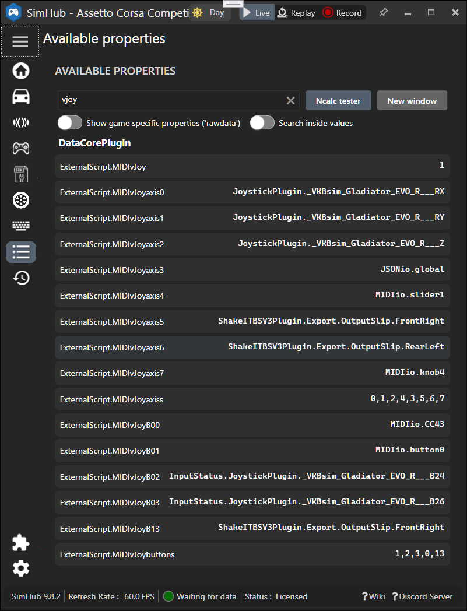

### MIDIio [SimHub](https://www.simhubdash.com/) plugin:&nbsp; now with Joystick support

**Note**: &nbsp;  *requires a recent [SimHub](https://www.simhubdash.com/download-2/) (9.X) version*  

For one each MIDI source, destination, and optionally vJoy destination device,  
 this [SimHub](https://github.com/SHWotever/SimHub) plugin can route configured Button, Slider and Knob
 [Control Change](https://www.midi.org/specifications-old/item/table-3-control-change-messages-data-bytes-2) (CC) messages,  
 SimHub properties and Joystick buttons and axes.  
MIDIio source values are made available as **SimHub properties**, e.g.  
for tweaking **ShakeIt Bass Shaker** effects and controlling [**JSONio**](https://github.com/blekenbleu/JSONio):  
  

Similarly, SimHub property values can be rescaled and sent as CCs and vJoy buttons and axes.  
*Unconfigured* CC messages received are optionally forwarded to destination MIDI,  
enabling those source MIDI CCs to directly control the destination MIDI.

MIDI C# code evolved from SimHub's `User.PluginSdkDemo`,  
using [`Melanchall.DryWetMidi`](https://github.com/melanchall/drywetmidi)'s DLL (already in SimHub).  

MIDIio *also* generates [DirectInput](https://blekenbleu.github.io/Windows/HID/) Button and Axis vJoy inputs for games,  
reusing [C# sample code](https://github.com/blekenbleu/vJoySDK) from [vJoy](https://github.com/njz3/vJoy).  
MIDI CC and [vJoy](https://blekenbleu.github.io/Windows/HID/vJoy/) values can include rescaled SimHub properties,  
 e.g. [**ShakeIt Bass Shaker** effects](https://github.com/SHWotever/SimHub/wiki/ShakeIt-V3-Effects-configuration).

MIDI CC *value changes* can optionally be configured (by 'MIDICCsends') as SimHub *Events*,  
with *values* sent as SimHub *Actions*.  

[Motivation and development How-To's](https://blekenbleu.github.io/MIDI/plugin/)  
[**MIDIio** Source code files, configuration descriptions](docs/source.md)  
[principles of operation](docs/principles.md)  
[June 2023 revisions provoked by SimHub updates](docs/provoked.md)

#### Notes:
- This plugin **was compatible with SimHub 8.4.3's `Controllers input` and `Control mapper` plugins**  
  - It has not been comprehensively tested for SimHub changes since then
  - This allows e.g. forwarding *real* DirectInput properties to MIDIout or vJoy;  
    **Do NOT** configure *vJoy* properties from `Controllers input`;&nbsp; that would provoke feedback loops!  
- This plugin is **incompatible with SimHub's `Midi Controllers Input`** plugin  
	- MIDIio wants exclusive access to source MIDI device.
    - Enabling both causes SimHub to crash!!!   
- Like SimHub's **`Midi Controllers Input`** plugin,  
  **MIDIio** can automatically set CCn properties  for received CCn messages not already configured,  
  but (unlike SimHub's) from **only its single configured source MIDI device**.  
- Unconfigured CCs for this device can be sorted by monitoring `CCin` in SimHub **Available properties**.
- SimHub bundles vJoy DLL v2.2.2.0, while [vJoy driver v2.1.9.1 is available](https://sourceforge.net/projects/vjoystick/).  
- This plugin has NO interactive user interface.
    - configure by editting [`NCalcScripts\MIDIio.ini`](blob/main/NCalcScripts/MIDIio.ini), which goes in `SimHub\NCalcScripts\` folder 
    - **check [System log](docs/SimHub.txt) for MIDI and/or vJoy related messages:**  
      
		*configuration details logged only for*`MIDIlog '7'`    

    - **Configure button `CCn` Source events:**  
        
		*Sources and Targets configured by*`MIDICCsends`  

    - **MIDIio** *neither is* (nor will become) a "plug and play" solution;  
      configuring MIDI on Windows is [**very much DIY**](https://www.racedepartment.com/threads/simhub-plugin-s-for-output-to-midi-and-vjoy.210079/).  
- **vJoy button numbering**  
    - Windows' `joy.cpl` and vJoy API consider the first button to be 1,  
      but SimHub reports that first button as `JoystickPlugin.vJoy_Device_B00`:  
        
    - For consistency within SimHub, first joystick button is configured as `MIDIvJoyB00` in [NCalcScripts/MIDIio.ini](NCalcScripts/MIDIio.ini).  

For testing, [this ShakeIt profile](https://github.com/blekenbleu/SimHub-profiles/blob/main/Any%20Game%20-%20MIDIio_proxyLS.siprofile)
 has a custom effect with ShakeITBSV3Plugin properties from MIDI sliders.

*18 Jun 2023*  
#### SimHub v8.4.3 breakage  
- JoystickPlugin properties no longer available during MIDIio `Init()`:
```
[2023-06-18 09:52:41,546] INFO - MIDIio.DoSend(vJoyaxis): null JoystickPlugin.SideWinder_Precision_2_Joystick_X for SourceName[1][0]
[2023-06-18 09:52:41,546] INFO - MIDIio.DoSend(vJoyaxis): null JoystickPlugin.SideWinder_Precision_2_Joystick_Y for SourceName[1][1]
[2023-06-18 09:52:41,546] INFO - MIDIio.DoSend(vJoyaxis): null JoystickPlugin.SideWinder_Precision_2_Joystick_Slider0 for SourceName[1][2]
[2023-06-18 09:52:41,551] INFO - Game successfully loaded
[2023-06-18 09:52:42,071] INFO - JoystickManager : Found Load_Cell_Interface_LC-USB, SideWinder_Precision_2_Joystick, vJoy_Device, T500_RS_Gear_Shift
```
---
- [Changes for SimHub > 8.4.3](docs/provoked.md)   
- [C# source code files](docs/source.md)  
- [IOproperties.cs Which[] byte array processing](docs/Which.md)  
- [MIDIio principles of operation](docs/principles.md)  
- [nanoKONTROL2 MIDI](docs/nanoKONTROL2_MIDIimp.txt)  
---
*1 Feb 2024*  
- [reduced log verbosity](docs/source.md#midiioini)

*24 May 2025* `version 0.0.1.3`
- tested vJoy axis with JSONio property;&nbsp; 0 to 100 range expected  
- changed example `MIDIio.ini` to use VKB instead of SideWinder HOTAS  
- test for non-zero `MIDIvJoy` setting (non-NULL `VJD`) before logging missing `MIDIvJoybuttons` or `MIDIvJoyaxiss`  
- bug fix:  test for null Darray[0-1] instead of (never) null Darray

*24 May 2025* `version 0.0.1.4`
- Release builds generate `MIDIio.zip`

*25 May 2025* `version 0.0.1.5`  
- CCin, Ping and SentEvent trace properties

*25 May 2025* `version 0.0.1.6`  
- fix unconfigured source CC logic

*25 May 2025* `version 0.0.1.7`
- `MIDIio.ini` comment strings
- updated .png's
- rename `ping` Actions to `send`
