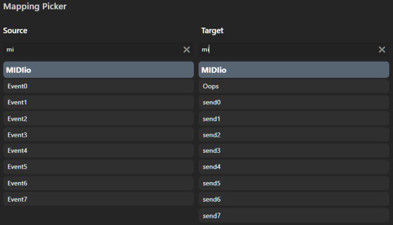

### MIDIio [SimHub](https://www.simhubdash.com/) plugin:&nbsp; now with Joystick, Event and Action support
 &emsp; *using [melanchall / drywetmidi](https://github.com/melanchall/drywetmidi)* &emsp; 
**Note**: &nbsp;  *requires a recent [SimHub](https://www.simhubdash.com/download-2/) (9.X) version*  

---
- [Changes for SimHub > 8.4.3](docs/provoked.md)  
- [C# source code files](docs/source.md)  
- [IOproperties.cs:&nbsp; Which[] byte array processing](docs/Which.md)  
- [MIDI and joystick devices](docs/devices.md)  
- [nanoKONTROL2 MIDI](docs/nanoKONTROL2_MIDIimp.txt)  
- [**principles of operation**](docs/principles.md)  
- [SimHub Events and Actions](docs/sends.md)  
- [user interface?](docs/UserInterface.md)  
---
For one each MIDI source, destination, and optionally vJoy destination device,  
 this [SimHub](https://github.com/SHWotever/SimHub) plugin can route configured Button, Slider and Knob
 [Control Change](https://www.midi.org/specifications-old/item/table-3-control-change-messages-data-bytes-2) (CC) messages,  
 SimHub game, joystick buttons and axes properties.  

['MIDIsends'](docs/source.md#midisends) configures vJoy and MIDI output buttons and axes  
[*value changes* as SimHub *Event triggers*, sending corresponding *values* as SimHub *Action targets*](docs/send.md).  
  
*the* **Oops** *Target can mapped from MIDIio Event triggers... displaying as* **oops** *property* values.

MIDIio source CC values are made available as **SimHub properties**, e.g.  
for tweaking **ShakeIt Bass Shaker** effects and controlling [**JSONio**](https://github.com/blekenbleu/JSONio):  
  

Similarly, SimHub property values can be rescaled and sent as CCs, vJoy buttons and axes.  
*Unconfigured* CC messages received are optionally echoed to destination MIDI,  
enabling those source MIDI CCs to directly control a destination MIDI device.

MIDI C# code evolved from SimHub's `User.PluginSdkDemo`,  
using [`Melanchall.DryWetMidi`](https://github.com/melanchall/drywetmidi)'s DLL (already in SimHub).  

MIDIio optionally uses [**vJoy**](https://github.com/shauleiz/vJoy) to simulate [DirectInput](https://blekenbleu.github.io/Windows/HID/) Button and Axis inputs,  
thanks to [C# sample code](https://github.com/blekenbleu/vJoySDK) from [@njz3](https://github.com/njz3/vJoy).  
MIDI CC and [vJoy](https://blekenbleu.github.io/Windows/HID/vJoy/) values can include rescaled SimHub properties,  
 e.g. [**ShakeIt Bass Shaker** effects](https://github.com/SHWotever/SimHub/wiki/ShakeIt-V3-Effects-configuration)
and [**JSONio** properties](https://github.com/blekenbleu/JSONio).

[Motivation and development How-To's](https://blekenbleu.github.io/MIDI/plugin/)  

#### Notes:
- This plugin **was compatible with SimHub 8.4.3's `Controllers input` and `Control mapper` plugins**  
  - **Controller mapping** has not been tested with newer SimHub versions.
  - MIDIio can send SimHub **Controllers** properties e.g. for *real* DirectInputs to its MIDIout or vJoy devices;  
    **Do NOT** configure *vJoy* properties from `Controllers input`;&nbsp; that would provoke feedback loops!  
- This plugin is **incompatible with SimHub's `Midi Controllers Input`** plugin  
	- MIDIio wants exclusive access to source MIDI device.
    - Enabling both causes SimHub to crash!!!   
- Like SimHub's **`Midi Controllers Input`** plugin,  
  **MIDIio** can automatically set CCn properties  for received CCn messages not already configured,  
  but (unlike SimHub's) from **only its single configured source MIDI device**.  
- Unconfigured CCs for this device can be sorted by monitoring `CCin` in SimHub **Available properties**.
- SimHub bundles [vJoy DLL v2.2.2.0](https://blekenbleu.github.io/Windows/HID/vJoy/), which works for me with [vJoy driver v2.1.9.1](https://sourceforge.net/projects/vjoystick/).  
    [vJoy driver v2.2.2 is available](https://github.com/BrunnerInnovation/vJoy/releases), but I have not tested it with MIDIio...  
- This plugin has NO interactive user interface.
    - configure by editting [`NCalcScripts\MIDIio.ini`](blob/main/NCalcScripts/MIDIio.ini), which goes in `SimHub\NCalcScripts\` folder 
    - **check [System log](docs/SimHub.txt) for MIDI and/or vJoy related messages:**  
        
	&emsp;	*configuration details logged only for*`MIDIlog '7'`    

    - **MIDIio** *neither is* (nor will become) a "plug and play" solution;  
      configuring MIDI on Windows is [**very much DIY**](https://www.racedepartment.com/threads/simhub-plugin-s-for-output-to-midi-and-vjoy.210079/).  
- **vJoy button numbering**  
    - Windows' `joy.cpl` and vJoy API consider the first button to be 1,  
      but SimHub reports that first joystick *input* button as `B00`;  
    - MIDIio configures that first vJoy button *for routing* as `MIDIvJoyB00` in [NCalcScripts/MIDIio.ini](NCalcScripts/MIDIio.ini).  
        
	  *However, that first vJoy button* is `B1` in `MIDIsends` for SimHub [Events](https://github.com/SHWotever/SimHub/wiki/NCalc-scripting#exporting-event-trigger--exportevent)
      and [Actions](https://store.lsr.gg/pages/help-simhub-actions)  
	Here is a minimal vJoy first button [Event](docs/source.md#midisends) example:
    ---
```
string vJoy = "set value='0' to disable vJoy outputs"
[ExportProperty]
name='MIDIvJoy'
value='1'

string log = "value=0:  Log only errors;  1:I/O failures;  3:Event issues;  7:verbose"
[ExportProperty]
name='MIDIlog'
value='7'

string event = "SimHub Event and Action mapping"
[ExportProperty]
name='MIDIsends'
value='B1'

string button = "first vJoy button for Event and Action mapping"
[ExportProperty]
name='MIDIsendB1'
value='InputStatus.JoystickPlugin.BavarianSimTec_OmegaPRO_v2_B00'
```
   ---

For testing, [this ShakeIt profile](https://github.com/blekenbleu/SimHub-profiles/blob/main/Any%20Game%20-%20MIDIio_proxyLS.siprofile)
 has a custom effect with ShakeITBSV3Plugin properties from MIDI sliders.

*18 Jun 2023*  **SimHub v8.4.3 breakage**
- JoystickPlugin properties no longer available during MIDIio `Init()`
	- [Changes for SimHub > 8.4.3](docs/provoked.md)  

*1 Feb 2024*  
- [reduced log verbosity](docs/source.md#midilog)

*24 May 2025* `version 0.0.1.3`
- tested vJoy axis with JSONio property;&nbsp; 0 to 100 range expected  
- changed example `MIDIio.ini` to use VKB instead of SideWinder HOTAS  
- test for non-zero `MIDIvJoy` setting (non-NULL `VJD`) before logging missing `MIDIvJoyButtons` or `MIDIvJoyAxiss`  
- bug fix:  test for null Darray[0-1] instead of (never) null Darray

*24 May 2025* `version 0.0.1.4`
- Release builds generate `MIDIio.zip`

*25 May 2025* `version 0.0.1.5`  
- CCin, [`send` Action Targets and source `event` properties]((docs/sends.md)) configuration logging

*25 May 2025* `version 0.0.1.6`  
- fix unconfigured source CC logic

*25 May 2025* `version 0.0.1.7`
- `MIDIio.ini` comment strings
- updated .png's
- rename `ping` Actions to `send`

*25 May 2025* `version 0.0.2.3`
- debug properties: oops, prop, Ping, CCin, CCsent, VJsent, in, out
- replace fixed size SourceName array by SourceList and ListCC
- relocated and debugged Sent[][] anti-duplication
- simplified Send();  move rescale to Active() and SendIf()

*30 May 2025* `version 0.0.2.4`
- complete replacing arrays based on MIDIsize with Lists
- fix `MIDIecho 4` non-MIDI property logging, eliminating duplicates
- except 'oops', debug properties only for `MIDIecho 4`
- updated docs, adding [devices](docs/devices.md)

*31 May 2025* `version 0.0.2.6`
- CC property code refactoring  
- add vJoy destinations for [`MIDIsends`](docs/sends.md) Actions and Events  
- [refactor Action and Event handling, adding vJoy](docs/principles.md#midiio-events-and-actions)  

*6 Jun 2025* `v0.0.3.4`  
- `MIDIsends` changes for vJoy and MIDI Event triggering and Action targets  
   broke `MIDIio.ini` configuration backward compatibility.

*8 Jun 2025* `v0.0.3.5`
- Act() fixes;&nbsp CC input Action parms all in `ActList`  
- avoid bogus Log entries if only vJoy Event handling  
