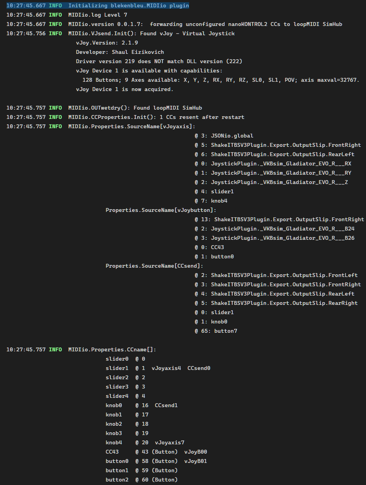
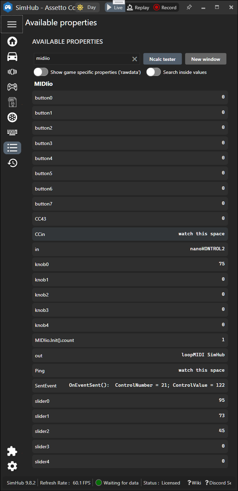
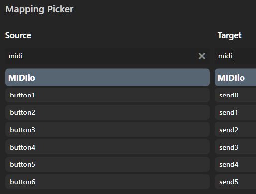

### blekenbleu.MIDIio [SimHub](https://www.simhubdash.com/) plugin
 For one MIDI device, this [SimHub](https://github.com/SHWotever/SimHub) plugin sends and reads configured Button, Slider and Knob  
 [Control Change](https://www.midi.org/specifications-old/item/table-3-control-change-messages-data-bytes-2) (CC) messages,
 to e.g. on-the-fly tweak suitably customized **ShakeIt Bass Shaker** effects.  
Unconfigured CC messages received dynamically generate new properties or are forwarded to a target Device.  
MIDI C# code evolved from SimHub's `User.PluginSdkDemo`,
using [`Melanchall.DryWetMidi`](https://github.com/melanchall/drywetmidi)'s DLL (already in SimHub).  

MIDIio also generates [DirectInput](https://blekenbleu.github.io/Windows/HID.md) Button and Axis joystick inputs for games,
reusing [C# sample code](https://github.com/blekenbleu/vJoySDK) from [vJoy](https://github.com/njz3/vJoy).  
MIDI CCs and [vJoy](https://blekenbleu.github.io/Windows/HID) sends are rescaled values from configured SimHub properties,
 e.g. [**ShakeIt Bass Shaker** effects](https://github.com/SHWotever/SimHub/wiki/ShakeIt-V3-Effects-configuration).

[Motivation and development How-To's](https://blekenbleu.github.io/MIDI/plugin/)  
[**MIDIio** Source code files, configuration descriptions](docs/source.md)  
[principles of operation](docs/principles.md)  

#### Notes:
- This plugin **is compatible with SimHub's Controllers plugin**  
  - This allows e.g. forwarding *real* **JoystickPlugin** properties to MIDIout or vJoy;  
    **Do NOT** configure *vJoy* properties from **JoystickPlugin**;&nbsp; that would provoke feedback loops!  
- This plugin is **incompatible with SimHub's Midi Controllers Input plugin**  
    - Enabling both causes SimHub to crash!!!   
- Like SimHub's **Midi Controllers Input** plugin,  
  **MIDIio** can automatically set CCn properties  for received CCn messages not already configured,  
  but (unlike SimHub's) from only the single configured MIDI device.  
  This is expected to be most useful for identifying CC numbers to configure.
- DirectInput requires [vJoy v2.1.6 device driver](https://sourceforge.net/projects/vjoystick/files/Beta%202.x/2.1.6.20-030216/), which probably cannot work in Windows 11.  
- This plugin is configured by [`NCalcScripts\MIDIio.ini`](blob/main/NCalcScripts/MIDIio.ini);&nbsp; it has NO interactive interface window.
    - configure this plugin by editing [`MIDIio.ini`](blob/main/NCalcScripts/MIDIio.ini), which goes in `SimHub\NCalcScripts\` folder 
    - **check System log for MIDI-related messages:**  
        

    - **check Available properties for MIDI-related values**:
      

    - **Configure button `CCn` Source events:**  
        
    - this is *not* (nor can it become) a "plug and play" solution;  
      configuring MIDI on Windows is [**very much DIY**](https://www.racedepartment.com/threads/simhub-plugin-s-for-output-to-midi-and-vjoy.210079/).

For testing, [this ShakeIt profile has a custom effect](https://github.com/blekenbleu/SimHub-profiles/blob/main/Any%20Game%20-%20MIDIio_proxyLS.siprofile) with ShakeITBSV3Plugin properties from MIDI sliders.
