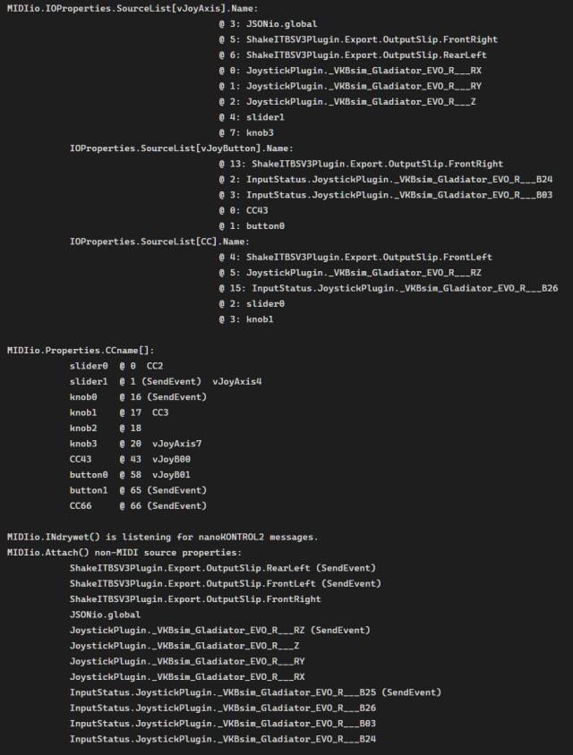
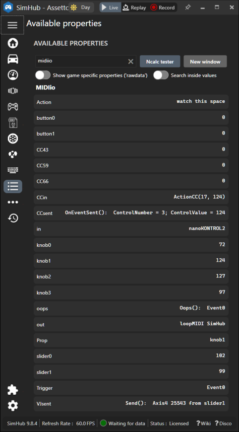

### blekenbleu.MIDIio SimHub plugin
 [SimHub](https://github.com/SHWotever/SimHub) plugin sends up to 8 MIDI Slider and reads up to 8 each Slider and Knob
 [Control Change Messages](https://www.midi.org/specifications-old/item/table-3-control-change-messages-data-bytes-2),   
 enabling e.g. on-the-fly tweaking of suitably customized **ShakeIt Bass Shaker** effects.  
 C# code evolved from SimHub's `User.PluginSdkDemo`,
using [`Melanchall.DryWetMidi`](https://github.com/melanchall/drywetmidi) (SimHub already did)  

[Motivation and development How-To's](https://blekenbleu.github.io/MIDI/plugin/)  
[Source code files, **MIDIio** configuration descriptions](docs/source.md)  
[principles of operation](docs/principles.md)  

#### Notes:
- This plugin is **incompatible with SimHub's Midi Controllers Input plugin**  
    - Enabling both causes SimHub to crash!!!   
    - Like SimHub's **Midi Controllers Input** plugin, **MIDIio** can automatically set CCn properties  
      for received CC n messages not already configured, but from only a single configured MIDI device.
- This plugin includes NO user interface code
    - configure **MIDIio** plugin by editing properties in `MIDIio.ini`, which goes in `SimHub\NCalcScripts\` folder 
    - **check System log for MIDI-related messages:**  
        

    - **check Available properties for MIDI-related values**:
      

    - **Configure button `CCn` Source events:**  
        
    - this is *not* (nor can it become) a "plug and play" solution;  
      configuring MIDI on Windows is [**very much DIY**](https://www.racedepartment.com/threads/simhub-plugin-s-for-output-to-midi-and-vjoy.210079/).
