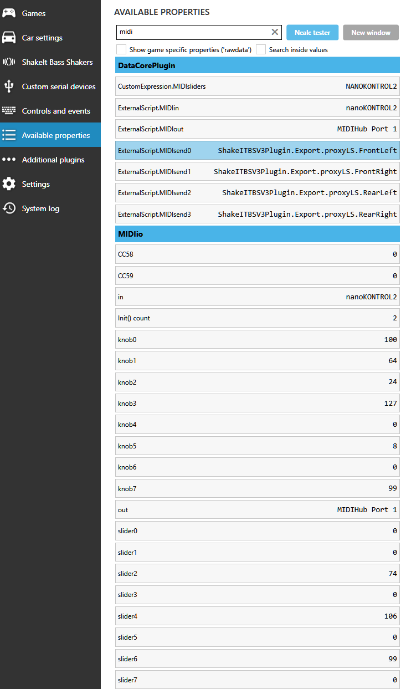

### blekenbleu.MIDIio SimHub plugin
 [SimHub](https://github.com/SHWotever/SimHub) plugin to read and send MIDI slider
 [Control Change Messages](https://www.midi.org/specifications-old/item/table-3-control-change-messages-data-bytes-2),  
 enabling e.g. on-the-fly tweaking of suitably customized **ShakeIt Bass Shaker** effects.  
 C# code evolved from `User.PluginSdkDemo`, using [`Melanchall.DryWetMidi`](https://github.com/melanchall/drywetmidi) (SimHub already did)  

[Motivation and How-To here](https://blekenbleu.github.io/MIDI/plugin/)

#### Notes:
- This plugin has no user interface code
    - configure by editing properties in `MIDIio.ini`, which goes in `SimHub\NCalcScripts\` folder 
    - check **System log** for MIDI-related messages:  
        
    - check **Available properties** for MIDI-related values:
      
    - this is *not* (nor can it become) a "plug and play" solution;  
      configuring MIDI on Windows is [**very much DIY**](https://www.racedepartment.com/threads/simhub-plugin-s-for-output-to-midi-and-vjoy.210079/).
