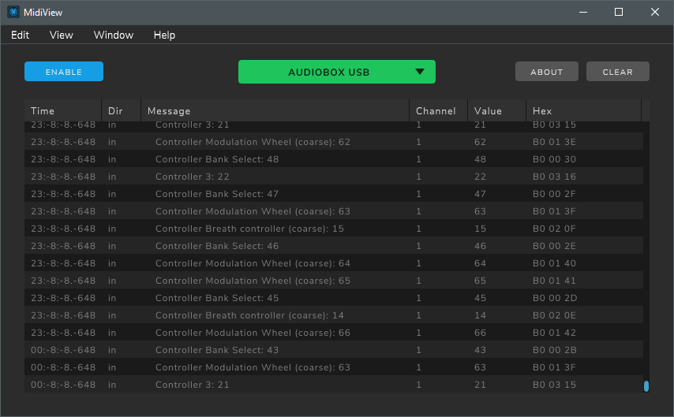
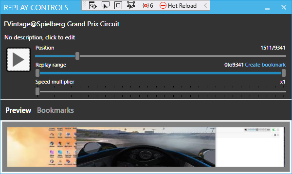

### blekenbleu.MIDIio SimHub plugin source code files (C# classes)
- [MIDIio.cs](../MIDIio.cs) class is the SimHub plugin equivalent of main().   
  It interfaces other classes to SimHub, handling properties, events, actions, initializations and cleanups.  
- [MIDIioSettings.cs](../MIDIioSettings.cs) is *only* data to be saved and restored between plugin launches.  
- [CCProperties.cs](../CCProperties.cs) initializes properties for MIDIio.cs.  
- [INdrywet.cs](../INdrywet.cs) handles MIDI messages from `MIDIin`
  using [Melanchall.DryWetMidi](https://github.com/melanchall/drywetmidi)  
- [OUTdrywet.cs](../OUTdrywet.cs) sends MIDI messages to `MIDIout`.  
- (*Not* a class);  [MIDIio.ini](../MIDIio.ini) has NCalc properties for configuring **MIDIio**.  
  It goes in `SimHub/NCalcScripts/`;&nbsp;  contents include:
  - `MIDIin`:      name of source MIDI device
  - `MIDIout`:     name of destination MIDI device
  - `MIDIsliders`: MIDI CC numbers `n` whose values are to be set as `slidern` properties.  
  - `MIDIknobs`:   MIDI CC numbers `n` whose values are to be set as `knobn` properties,  
                   handled identically to `MIDIsliders`  
  - `MIDIbuttons`: MIDI CC numbers `n` to be set as `CCn` properties and, when (values > 0), also raise events.  
  - `MIDIsendn`:   name of e.g. a ShakeIt property whose value *changes* are sent to `MIDIout`  
                    as `CCn` messages for `0 <= n < 8`.  
                   A `pingn` action will be enabled for each configured `MIDIsendn`.  
                   By mapping a `CC` **Source** to a `pingn` **Target** in SimHub's **Controls and events**,  
                   the corresponding `MIDIin` device button can be used
                   to help identify that `CCn` to a `MIDIout` application.  
  - `MIDIecho`:    if `0` or not defined, all received CC values `n` not otherwised configured  
                   (in `MIDIsliders`, `MIDIknobs` or `MIDIbuttons`) are automatically created as `CCn` properties,  
                   else (`MIDIecho > 0`) unconfigured MIDI messages are forwarded from `MIDIin` to `MIDIout`.

To avoid conficts with configured sends,  
`MIDIecho 1` remaps unconfigured `MIDIin` CC messages and forwards them to `MIDIout`.  
Un-echoed CC messages most recently sent to `MIDIout` are saved,  
then resent when SimHub next launches the MIDIio plugin.  
This is intended to enable resuming a MIDI configuration from time to time.  
Duplicated send CC messages are NOT sent, to minimize traffic and CPU overhead.  
In `MIDIecho 1` mode, only valid configured input and send CC message sources  
  are configured as SimHub properties, also to minimize CPU overhead.  
In `MIDIecho 0` mode, SimHub properties are dynamically generated for unconfigured input CC numbers.  
This allows learning (by checking SimHUb's **Property** window)  
what previously unconfigured CC numbers may want adding to `SimHub/NCalcScripts/MIDIio.ini`.  

Here is evidence of operational success (*26 Jan 2023*):  
- **[MidiView](https://hautetechnique.com/midi/midiview/) trace screen**:  
  

- ... for this game replay:  
  

