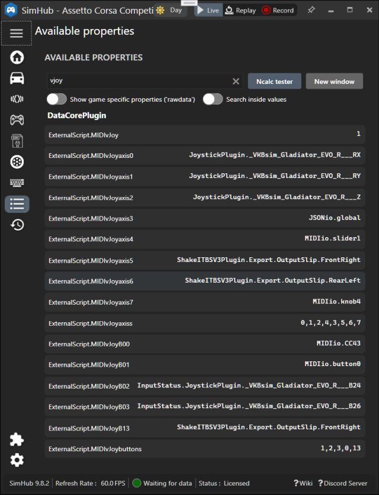

[*back*](../README.md)

### blekenbleu.MIDIio SimHub plugin source code files (C# classes)
- [MIDIio.cs](../MIDIio.cs) class is the SimHub plugin equivalent of main().   
  It interfaces other classes to SimHub, handling properties, events, actions, initializations and cleanups.  
  - `DataUpdate()` invokes `SendIf()`.
- [Attach.cs](../Attach.cs)
	- `EnumActions()` calls `SendAdd()`
	- `Attach()` calls `CCprop()` to AttachDelegate() CCnames[]
- [CCprop.cs](../CCprop.cs) initializes CC input properties for MIDIio.cs.  
- [Init.cs](../Init.cs) is MIDIio's `Init()`, which sorts `MIDIio.ini`  
- [InitCC.cs](../InitCC.cs) `InitCC()` initializes `CCname[]`, `CCvalue[]`, `ListCC[]`, `Map[]`, `Which[]`
	- `IOproperties.Init()` calls `WhichCC()` or `SourceList[].Add()` to configure destination routings
- [INdrywet.cs](../INdrywet.cs) handles MIDI messages from `MIDIin`
  using [Melanchall.DryWetMidi](https://github.com/melanchall/drywetmidi)  
- [MIDIioSettings.cs](../MIDIioSettings.cs) is *only* data to be saved and restored between plugin launches.  
- [OUTdrywet.cs](../OUTdrywet.cs) sends MIDI messages to `MIDIout`.  
- [Send.cs](../Send.cs) filters, routes, rescales CC and vJoy messages
  - `SendIf()` filters and routes to `Send()`   
  - `ReceivedCC()` updates **MIDIio** properties based on `INdrywet` ControlChangeEvents  
	- invokes `Send()` for CCs routed as MIDI sends
  - `Send()` rescales and writes changed values to `VJsend` or `OUTdrywet`.
- [SendAdd.cs](../SendAdd.cs) configures Actions and Events
- [VJsend.cs](../VJsend.cs) sends button and axis values to a single vJoy device.
- [VJoyFFBReceiver.cs](../VJoyFFBReceiver.cs) placeholder code for handling vJoy force feedback data.

## MIDIio.ini configuration
- [MIDIio.ini](../NCalcScripts/MIDIio.ini) contains NCalc properties for configuring **MIDIio**.  
  It goes in `SimHub/NCalcScripts/`;&nbsp; contents include:
  - `MIDIin`:&nbsp; MIDI source device name
  - `MIDIout`:&nbsp; MIDI destination device name
  - `MIDIknobs`:&nbsp; MIDI CC numbers `n` whose values get set as `knobn` properties,  
  - `MIDIsliders`:&nbsp; MIDI CC numbers `n` whose values get set as `slidern` properties.  
                     handled identically to `MIDIknobs`  
  - [`MIDIbuttons`](#midibuttons):&nbsp; MIDI CC numbers `n` to be set as `CCn` properties and also raise events.  
  - [`MIDImaps`](#midimaps):&nbsp; Index array of configured `MIDImapn`, where CC 0 <= n < 128
  - [`MIDIsends`](#midisends):&nbsp; Index array of configured `MIDIsemd[ABC]n`
  - [`MIDIecho`](#midiecho):&nbsp; `MIDIin` CC message handling
  - [`MIDIlog`](#midilog):&nbsp; Controls MIDIio's **[System Log](SimHub.txt)**
		[verbosity](#midilog);&nbsp; 0 is mostly only errors and 7 is maximally verbose.  
  - `MIDIvJoy`:&nbsp; Non-zero enables vJoy button and axes outputs  
  - `MIDIvJoyAxiss`:&nbsp; Index array of configured `MIDIvJoyAxisx`, where 0 <= x < 8 Axes  
                     as reported by `MIDIio.VJsend.Init()` in the **[System Log](SimHub.txt)**
  - `MIDIvJoyButtons`:&nbsp; Index array of configured `MIDIvJoyButtonx`, where 01 <= x < 16 Buttons  
                     as reported by `MIDIio.VJsend.Init()` in the **[System Log](SimHub.txt)**  

### MIDIbuttons
- `MIDIbuttons` **Source** events can be mapped to **Target** actions in SimHub's **Controls and events**.  
**SimHub limitation:**&nbsp; event and action handling works only during games or replays

### MIDImaps
- a string of comma-separated `MIDIout` destination CC numbers '0' <= 'n' < '128', which each want a MIDImapn
- e.g.: `value='1,4,51,14'`
- each comma-separated destination wants a corresponding `MIDImapn`

### MIDImapn
- a `MIDIin` CC or SimHub property name whose changing values are destined for `MIDIout`
- `MIDIio.ini` configuration example:
```
	[ExportProperty]
	name='MIDImap1'
	value='MIDIio.slider1'
```

### MIDIsends
- a value string of comma-separated destinations for Actions
	- 'An' for vJoy axis 'n'
	- 'Bnn' for vJoy button 'nn'
	- 'Cn' for `MIDIout` for CC number 'n'
	- each comma-separated destination wants a corresponding `MIDIsend[ABC]n`

### MIDIsend[ABC]n
- corresponds to an '[ABC]n' substring of `MIDIsends` value
- examples [**here**](sends.md)
- A `MIDIio.sendn` **Target** `MIDIio.sendn` Action is enabled for each configured destination in `MIDIsends`.  
	- its `MIDIio.ini` value string names a source property for destination message values
    - each value change triggers a corresponding Event
	- Events to Actions are mapped by SimHub **Controls and events**
	- **SimHub limitation:**&nbsp; Event and Action handling works only during games or replays

### MIDIecho
- most recent messages echoed to  `MIDIout` for unconfigured CCs  
  get resent when SimHub relaunches this plugin.  
  This is intended to restore MIDI device state (e.g. fader levels).
- All unconfigured CCs received are dynamically set as properties

`MIDIecho 1`
- forward unconfigured `MIDIin` CC changed messages to `MIDIout`.
  these get re-sent when relaunches this plugin
  discovered CC properties are retained across restarts

`MIDIecho 0`
- reset dynamically generated CC properties when MIDIio `End()`s

### MIDIlog
3-bit flags;&nbsp; valid values:  
- 0:&nbsp; log only exceptions not handled by code or things not working, e.g. misconfigured
- 1:&nbsp; log also I/O failures
- 3:&nbsp; also unexpected events
- 7:&nbsp; (verbose) also information, initialization and configuration feedback; enables debug properties

### Evidence
Here is some evidence of operational success (*26 May 2025*):  
- `MIDIio.Unconfigured` property:&nbsp; the most recent unconfigured CC received  
   This allows learning MIDI controller CC numbers (by checking SimHUb's **Property** window)
- `MIDIio.SendCC` property:&nbsp; most recently sent
- `MIDIio.OnEventSent` property:&nbsp; most recent `MIDIio.OnEventSent()`
- **[MidiView](https://hautetechnique.com/midi/midiview/) trace screen** (*26 Jan 2023*):  
  
- SimHub vjoy properties, Game Controllers control panel vJoy device properties:  
  

- ... for a game replay:  
  

 *updated 23 Feb 2023 for vJoy*  
 *updated 29 Jun 2023 for [SimHub-provoked revisions](docs/provoked.md)*  
 *updated 1 Feb 2024 for `MIDIlog` explanations*  
 *updated 26 May 2025 for `MIDIlog`, `MIDIbuttons` and `MIDIsend` changes*  
 *updated 28 May 2025 for `MIDIio.cs` refactoring (`Init.cs', `Send.cs`)*  
